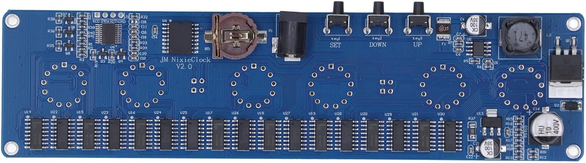

# JM NixieClock V2.0 Custom Firmware by 555otis666



Custom firmware for the Geek Styles / `JM NixieClock V2.0` IN-14 clock board with an `STM8S003F3P6`, `DS3231NS` RTC and chained `74HC595` display drivers.

The firmware was written after reverse engineering the board with a multimeter and ST-Link V2. The main goal was to replace the original fixed night blanking mode with configurable blanking hours.

## Also known as

This board may be found online under several similar names:

- `JM NixieClock V2.0`
- `JM Nixie Clock V2.0`
- `GeekStyles IN14 Nixie Clock`
- `Geek Styles IN-14 Nixie Clock`
- `IN-14 STM8 Nixie Clock`
- `STM8S003F3P6 DS3231 Nixie Clock`
- `AliExpress Nixie Clock`
- `AliExpress IN14 Nixie Clock Kit`
- `IN14 Nixie AliExpress`

## Current status

Tested on one clock board:

- time display from DS3231: `HHMMSS`
- time setting with `SET`, `UP`, `DOWN`
- 12h/24h mode
- configurable night blanking start/end time
- night blanking turns off tubes and both colon separators
- RGB backlight mode switching
- anti-poison routine, configurable from 1 to 9 minutes
- settings saved in STM8 EEPROM

## Important files

- `firmware/jm_nixieclock_v2_custom_firmware.asm` - main firmware source
- `firmware/jm_nixieclock_v2_custom_firmware.s19` - latest generated firmware image
- `menu_map.html` - visual menu map
- `electrical_schematic.html` - reverse-engineered electrical overview
- `docs/hardware.md` - confirmed hardware pin map
- `docs/menu.md` - user interface behavior
- `build.ps1` - build firmware with ST Toolset assembler
- `flash.ps1` - flash `.s19` with STVP command line

## Build

Install ST Visual Develop / ST Toolset for STM8. The default scripts expect:

```powershell
C:\Program Files (x86)\STMicroelectronics\st_toolset\asm\
C:\Program Files (x86)\STMicroelectronics\st_toolset\stvp\
```

Build:

```powershell
.\build.ps1
```

If PowerShell blocks local scripts, use:

```powershell
powershell -ExecutionPolicy Bypass -File .\build.ps1
```

Flash with ST-Link V2:

```powershell
.\flash.ps1
```

or:

```powershell
powershell -ExecutionPolicy Bypass -File .\flash.ps1
```

## Hardware warning

This project drives a Nixie clock board. The board contains a high-voltage supply for the tubes. Disconnect power before probing or wiring the programmer, and be careful around the tube supply section.
